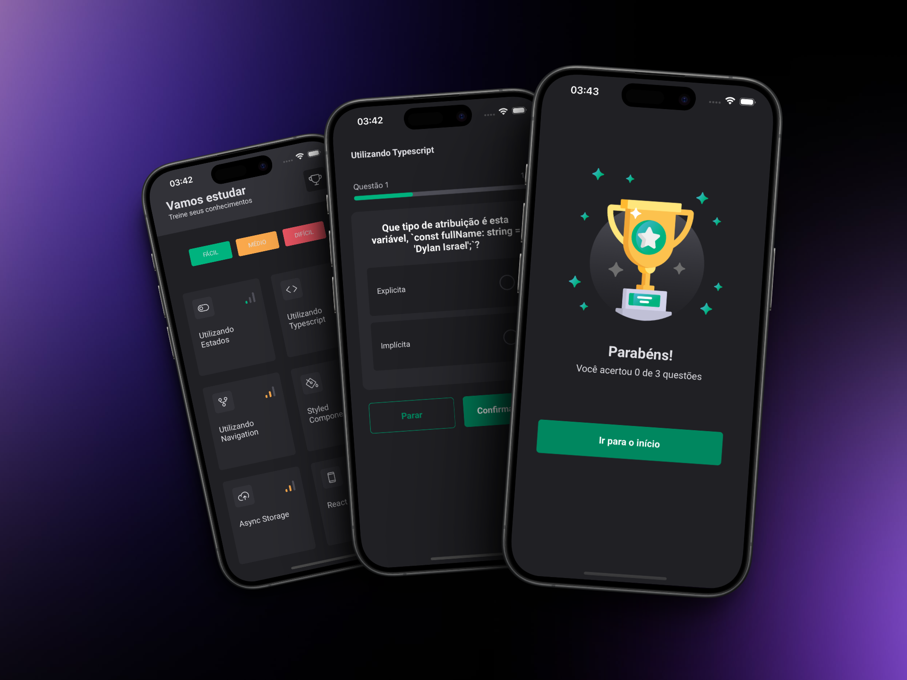

# Tech Quiz

## O que é necessário para testar essa aplicação?

- Ter o [Node.js](https://nodejs.org/en) instalado acima da versão 18;
- Ter o gerenciador de pacotes [Yarn](https://yarnpkg.com/) instalado;
- Simuladores: [Xcode](https://developer.apple.com/xcode/) ou [Android Studio](https://developer.android.com/)

## Principais Tecnologias Utilizadas

- [React-Native](https://reactnative.dev/)
- [Expo](https://expo.dev/)
- [TypeScript](https://www.typescriptlang.org/)
- [React Navigation](https://reactnavigation.org/)
- [React Native Reanimated](https://docs.swmansion.com/react-native-reanimated/)
- [React Native Skia](https://shopify.github.io/react-native-skia/)
- [React Native Gesture Handler](https://docs.swmansion.com/react-native-gesture-handler/)

## Rodando Localmente

Clone o projeto

```bash
  git clone https://github.com/flpcastro/techquiz.git
```

Entre no diretório do projeto

```bash
  cd techquiz
```

Instale as dependências

```bash
  npm install
```

Execute no emulador de sua preferência

```bash
  npx expo run:ios
  npx expo run:android
```

```
techquiz
├── assets/
├── src/
│   ├── @types/
│   ├── assets/
│   ├── components/
│   ├── data/
│   ├── routes/
│   ├── screens/
│   ├── storage/
│   ├── styles/
├── .gitignore
├── app.json
├── App.tsx
├── babel.config.js
├── metro.config.js
├── package-lock.json
├── package.json
├── README.md
└── tsconfig.json
```

## Documentação de cores

| Cor           | Hexadecimal                                                      |
| ------------- | ---------------------------------------------------------------- |
| White         |  #FFFFFF |
| Brand Light   |  #00B37E |
| Brand Mid     |  #00875F |
| Warning Light |  #FBA94C |
| Danger Light  |  #F75A68 |
| Label         |  #A6A1B2 |
| Star Blue     |  #57B6E5 |
| Star Green    |  #00B37E |
| Star Gray     |  #6F6F6F |
| Gray 100      |  #E1E1E6 |
| Gray 300      |  #8D8D99 |
| Gray 500      |  #505059 |
| Gray 600      |  #323238 |
| Gray 700      |  #29292E |
| Gray 800      |  #202024 |

## Documentação das Fontes

| Nome   | Tipo     |
| ------ | -------- |
| Roboto | **Bold** |
| Roboto | Regular  |

## Screenshoots

<div align="center">
  
</div>
